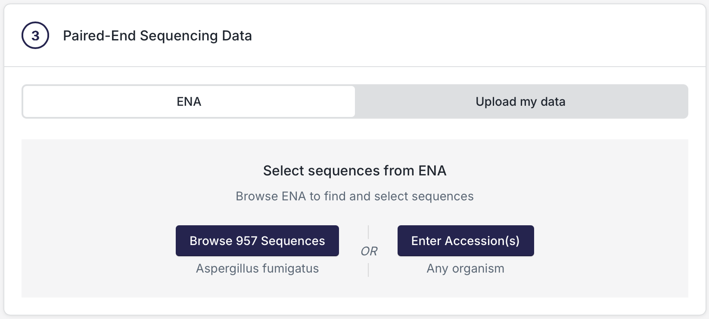
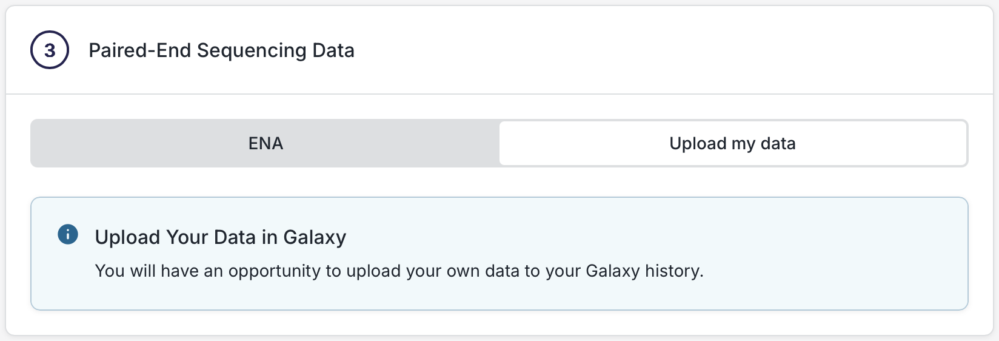
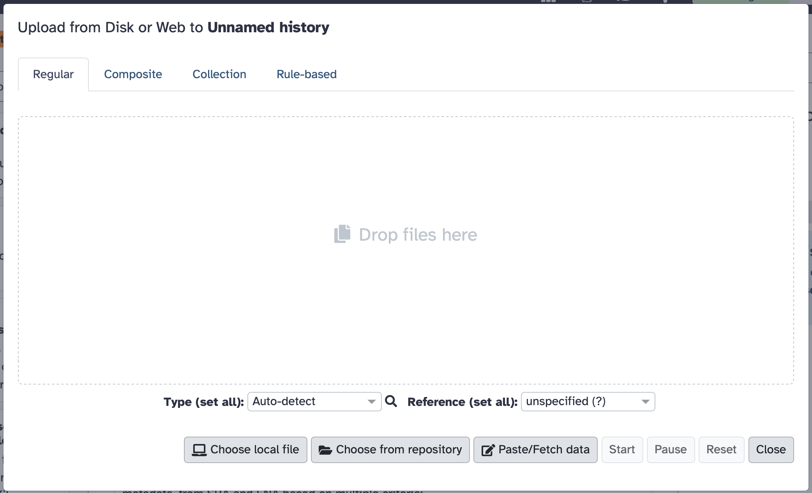
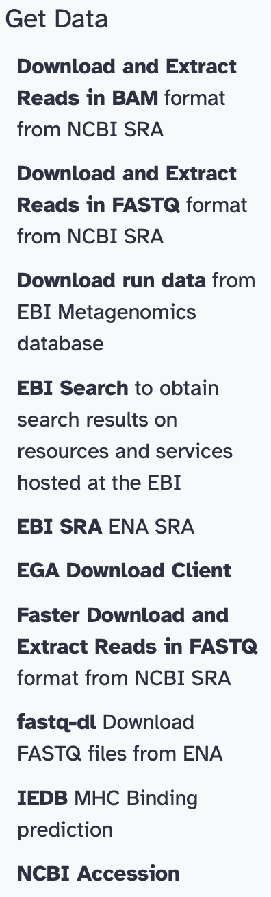

# Getting your data into Galaxy

During the course of using BRC-Analytics and working through workflow configurations for many of the workflows, you will be presented with a step that looks like this:

which makes it really easy to fetch public data from SRA/ENA. But what if your data is sitting on your laptop, or on your local network shared drive, or on another web site, or in a cloud storage service?  You can click the "Upload my data" option in this dialog, which puts of dealing with data until you arrive at Galaxy:

So, the question is, how do you get your data into Galaxy once you get there. Galaxy has a plethora of ways to get your data into Galaxy so that you can carry on with your analysis workflows. Here's a comprehensive list:

## 1. The Upload Tool

The Upload tool is accessible via the activity bar on the left side of the page (look for the arrow/upload icon). The dialog has four tabs across the top and action buttons along the bottom.

### Tabs

**Regular** (default) — The standard single-file or multi-file upload interface. Use the buttons along the bottom to add files (see below).

**Composite** *(TODO: add description)* — For uploading composite dataset types that consist of multiple files (e.g. formats that require a data file plus an index file).

**Collection** *(TODO: add description)* — Upload files and organize them directly into a dataset collection.

**[Rule-Based](https://training.galaxyproject.org/training-material/topics/galaxy-interface/tutorials/upload-rules/tutorial.html)** — A powerful bulk import interface where you provide a table or list of URLs/accessions, then define rules (column assignments, transformations, filters) to map them to dataset names, types, genome builds, and collection structures. Can load the initial metadata from a pasted table, a CSV/TSV, or from an existing dataset in your history. Ideal for importing dozens to hundreds of files at once and organizing them directly into collections.

### Buttons

**[Choose Local File](https://help.galaxyproject.org/t/uploading-files/16255)** — Drag and drop or browse to select files directly from your computer. Supports most common bioinformatics formats. You can set the file type and genome build at upload time, or let Galaxy auto-detect them.

**[Choose from Repository](https://docs.galaxyproject.org/en/latest/lib/galaxy.files.sources.html)** *(TODO: find better user-facing source)* — Browse and import from configured remote file sources. On usegalaxy.org this can include cloud storage (Google Drive, Dropbox, AWS S3, WebDAV-based services like Nextcloud/ownCloud/EUDAT B2Drop), InvenioRDM repositories, Dataverse instances, and iRODS. Users can configure their own personal remote file sources under User Preferences → Manage Your Remote File Sources which can be accessed from the "+ Create New" at the bottom of the repository dialog box after clicking the "Choose from repository" button.

**[Paste/Fetch Data](https://docs.galaxyproject.org/en/latest/_modules/galaxy/schema/fetch_data.html)** *(TODO: find better user-facing source)* — Paste raw text data directly (e.g., a FASTA sequence, a BED interval, a list of IDs), or paste one or more URLs (HTTP, HTTPS, FTP). Galaxy fetches the remote file and deposits it into your history. Supports multiple URLs at once (one per line).

*Note: [FTP upload](https://docs.galaxyproject.org/en/master/admin/special_topics/ftp.html) is **not** currently supported on usegalaxy.org (it is available on usegalaxy.eu and other instances).*

---

## 2. "Get Data" Toolbox — Built-in Data Source Connectors

These are Galaxy tools that act as query interfaces to external databases, depositing results directly into your history:

**[UCSC Main Table Browser](https://training.galaxyproject.org/training-material/topics/introduction/tutorials/galaxy-intro-strands/tutorial.html)** *(TODO: find source specific to UCSC Table Browser tool)* — Query and download genomic intervals, gene annotations, conservation tracks, repeat elements, SNPs, and more from UCSC's databases for dozens of organisms.

**NCBI Accession Download** — Fetch sequences by GenBank/RefSeq accession numbers (nucleotide or protein).

**[Download and Extract Reads in FASTQ format from NCBI SRA (fasterq-dump)](https://training.galaxyproject.org/training-material/faqs/galaxy/dataupload_NCBI_SRA.html)** — Provide one or more SRA run accessions (SRR, ERR, DRR) and Galaxy downloads and converts the reads to FASTQ directly. Supports paired-end splitting.

**Download and Extract Reads in BAM format from NCBI SRA** — Same as above but outputs aligned reads in BAM format.

**[EBI SRA](https://training.galaxyproject.org/training-material/faqs/galaxy/dataupload_EBI-SRA.html)** — Browse or query the European Bioinformatics Institute's Sequence Read Archive and import datasets directly.

**EBI Search** *(TODO: add description)* — Search and retrieve data from EBI's cross-database search service.

**Download run data from EBI Metagenomics database** *(TODO: add description)* — Retrieve metagenomic run data from the EBI Metagenomics (MGnify) database.

**EGA Download Client** *(TODO: add description)* — Download controlled-access datasets from the European Genome-phenome Archive.

**NCBI Datasets Genomes** — Download genome assemblies, annotation files, and metadata by NCBI accession or taxon.

**NCBI Datasets Gene** — Download gene records and associated sequences by gene ID or symbol.

**UniProt** *(TODO: add description)* — Query and download protein sequence and functional annotation data from UniProt.

**Unipept** *(TODO: add description)* — Analyze metaproteomics data using the Unipept database.

**IEDB** *(TODO: add description)* — Fetch immune epitope data from the Immune Epitope Database.

**Protein Database Downloader** *(TODO: add description)* — Download protein sequences from major databases.

**fastq-dl** *(TODO: add description)* — Download FASTQ files from SRA or ENA by accession.

**pysradb search** *(TODO: add description)* — Search and retrieve metadata and data from NCBI SRA using pysradb.

---

## 3. Data Libraries

Galaxy Data Libraries are server-side shared data stores curated by administrators (or by users with appropriate permissions). You can import datasets from a library directly into your history without re-uploading, making them useful for shared reference files (genomes, annotation sets, test datasets). In the current usegalaxy.org interface, access Libraries via the **Libraries** button in the activity bar on the left side of the window. See the [Data Libraries documentation](https://galaxyproject.org/data-libraries/) for more details.

---

## 4. Shared & Imported Histories

Access all history views via the **Histories** button in the activity bar on the left side of the page. The panel has four tabs:

**My Histories** — Your own histories. From here you can switch active histories or copy datasets between them without re-uploading.

**[Histories Shared with Me](https://galaxyproject.org/learn/share/)** — Histories that other Galaxy users have shared directly with your account. You can import datasets from these into your own history.

**Public Histories** — Publicly accessible histories published by any Galaxy user. Useful for reproducing published analyses or finding example datasets. You can import datasets from these into your own history.

**Archived Histories** — Your own histories that have been archived.

---

## 5. Programmatic / API Access

**[Galaxy REST API](https://docs.galaxyproject.org/en/latest/api_doc.html)** — Galaxy exposes a full REST API. You can upload files (multipart POST to `/api/tools` using the upload tool), fetch URLs, create histories, and populate them with datasets entirely programmatically using any HTTP client.

**[BioBlend (Python library)](https://training.galaxyproject.org/training-material/topics/dev/tutorials/bioblend-api/tutorial.html)** — A Python wrapper around the Galaxy API. Key methods include `gi.tools.upload_file()` for local files, `gi.tools.put_url()` for remote URLs, and dataset copying between histories. Enables scripted, reproducible data ingest as part of larger pipelines.

**galaxy-upload CLI** *(TODO: find documentation link)* — A command-line utility (`galaxy-upload`) for uploading files to a Galaxy server from the terminal, using your API key.

---

## 6. Workflow-Based Import

**[Workflow Inputs](https://training.galaxyproject.org/training-material/topics/galaxy-interface/tutorials/workflow-editor/tutorial.html)** — When you invoke a workflow, you map its input slots to existing datasets or dataset collections in your history. While not "uploading" new data per se, this is a key pathway for directing data through automated multi-step analyses.

**Workflow-Generated Outputs as Inputs to Other Workflows** — Outputs of one workflow run sitting in your history can be fed as inputs to subsequent workflows, enabling chained data flows.

---

## 7. Cross-Server and External Transfers

**Export/Import Between Galaxy Servers** — Histories and individual datasets can be exported from one Galaxy server and imported into usegalaxy.org via a URL or downloaded archive, enabling transfer between Galaxy instances.

**Onedata Remote Import** — Galaxy supports Onedata (a distributed storage platform used in European research infrastructure) as a remote file source for browsing and importing datasets.

---

## Summary Table

| Category | Method |
|---|---|
| Upload Tool | Local file, Paste/Fetch URL, Remote Files (cloud/WebDAV/S3/Dropbox/GDrive), Deferred, Rule-Based Bulk Import |
| Get Data Tools | UCSC, EBI SRA, NCBI SRA, BioMart, InterMine family, NCBI Datasets, NCBI Accession, ENA, IEDB |
| Shared Data | Data Libraries, Published Histories |
| History Management | Copy datasets between histories |
| API / Programmatic | REST API, BioBlend (Python), galaxy-upload CLI |
| Workflows | Workflow input mapping, chained workflow outputs |
| Cross-Server | History import/export, Onedata |

---

## Sources

- [Getting Data into Galaxy – Galaxy Training slides](https://training.galaxyproject.org/training-material/topics/galaxy-interface/tutorials/get-data/slides-plain.html)
- [Loading Data – Galaxy Hub](https://galaxyproject.org/support/loading-data/)
- [Rule Based Uploader Tutorial](https://galaxy.genouest.org/training-material/topics/galaxy-interface/tutorials/upload-rules/tutorial.html)
- [Galaxy FTP Uploads (admin docs)](https://docs.galaxyproject.org/en/master/admin/special_topics/ftp.html)
- [Getting Data into Galaxy – Community Help](https://help.galaxyproject.org/t/getting-data-into-galaxy/10868)
- [BioBlend API Documentation](https://bioblend.readthedocs.io/en/latest/api_docs/galaxy/all.html)
- [Importing from Onedata Tutorial](https://training.galaxyproject.org/training-material/topics/galaxy-interface/tutorials/onedata-remote-import/tutorial.html)
- [FAQ: Copy a dataset between histories](https://training.galaxyproject.org/training-material/faqs/galaxy/histories_copy_dataset.html)
- [Data import into Galaxy – deepTools docs](https://deeptools.readthedocs.io/en/develop/content/help_galaxy_dataup.html)
